# Semantic Segmentation Model with U-Net

## Table of Contents
- [Introduction](#introduction)
- [Features](#features)
- [Dataset](#dataset)
- [Model Architecture](#model-architecture)
- [Training Process](#training-process)
  - [Hyperparameters](#hyperparameters)
  - [Loss Functions](#loss-functions)
  - [Training Loop](#training-loop)
- [Inference](#inference)
- [Results](#results)
  - [Test Images](#test-images)
  - [Training Evaluation](#training-evaluation)
- [How to Use](#how-to-use)
- [Challenges and Future Improvements](#challenges-and-future-improvements)
- [Acknowledgments](#acknowledgments)
- [References](#references)

---

## Introduction
This project focuses on the implementation and training of a **semantic segmentation model** based on the U-Net architecture. 
Semantic segmentation involves classifying each pixel of an image into a category (e.g. road, sky, car) to provide a detailed understanding of a scene (image).
The goal is to perform classification of images using a deep learning model. This serves as a stepping stone towards building my next project: Diffusion Model

---

## Features
- End-to-end implementation of a semantic segmentation pipeline.
- U-Net architecture with batch normalization and dropout.
- Supports class-wise IoU and Dice metrics for evaluation.
- Handles dataset preprocessing and visualization.

---

## Dataset
- Originally intended to use the VOC 2007 dataset, but later switched to Cityscapes.
- Within the Cityscapes dataset, there is around 3,500 image-mask pairs used, where I scaled all of it down to 512x256 resolutions
- More details can be found within the `readme.md` file within the `Dataset` folder

---

## Model Architecture

- This is based on the U-Net architecture, where it takes in an image and is trained to output a segmented mask
- Input image should be divisible by 16 along both dimensions (Since it's max-pooled by 2x2 kernels four times along encoder)
- Output mask would be of the same shape as input image (Assuming both dim % 16 == 0)
- Added batch norm and dropout layers for normalization/regularization

  
<strong>U-Net Diagram</strong>

  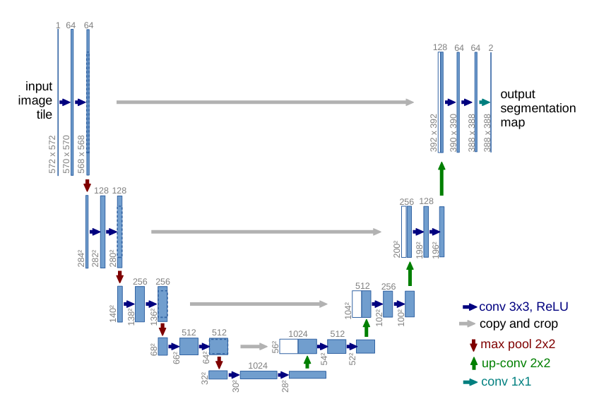

---

## Training Process

### Hyperparameters
- `batch_size`
  -  Number of image-mask pairs to use per iteration in training stage
- `training_iterations`
  -  Number of 'training iterations', though it's a bit of a misnomer, as in each iteration, there would be 'accum_steps' iterations within it for gradient accumulation. Thus, the number of total iterations would be `training_iterations` * `accum_steps`
- `accum_steps`
  -  Number of accumulation steps for gradient accumulation (stabilize training)
- `eval_interval`
  -  Interval at which the model performance would be evaluated based on validation data and 'Intersection over Union' metric 
- `eval_iterations`
  -  Number of iterations to used to evaluate the model
- `save_model_interval`
  -  Interval at which the model's statedict should be saved
- `base_lr`
  -  Base learning rate (lr)
- `min_lr`
  -  Minimum lr
- `warmup_steps`
  -  Number of warmup-steps before model reaches peak (base) lr
- `decay_factor`
  -  Factor that decides how quickly the lr decays once peak lr has been reached

## Model Learning Rate
For this model's learning rate, I just created a simple piece-wise function where the warmup lr is based on a quadratic curve and decay is based on an inverse sqrt curve
Below is a depiction of what it looks like in desmos:

  
<strong>Learning Rate Plot</strong>

  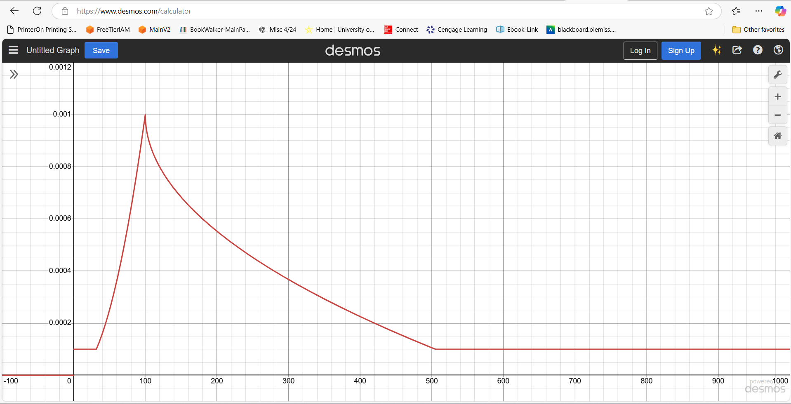

Here is the used function:

  
<strong>Learning Rate Function</strong>

  

Although the function may look a bit complicated, only two parts of it is important:
Warmup-Steps and Decay Curve

Feel free to play around with it, though I wouldn't be explaining about the particular implementations in detail as that would take some time

### Loss Functions
- A simple, custom loss function was used for the model's training, the sum of CrossEntropyLoss and DiceLoss
- The loss used to backprop throughout the network is just `final_loss = CrossEntropyLoss + DiceLoss`
- This was decided after some basic testing of using CrossEntropy by itself, DiceLoss by itself, along with various scaling of both losses then summed together. In the end, most differences were small, and a simple sum of the two losses were chosen

### Training Loop
Ideally, I would prefer to showcase the training progress of the image-mask-prediction sets side by side, however due to the Cityscape's Terms and Conditions, I would not be able to show any images/masks from that dataset.
Here, only the predicted mask will be displayed that was predicted across various intervals during the training loop (Each prediction is based on a different image)

  

    
Prediction 1

    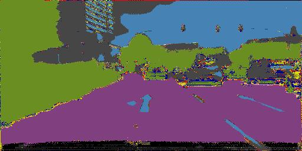
  

  

    
Prediction 2

    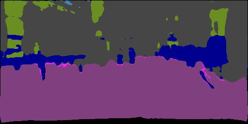
  

  

    
Prediction 3

    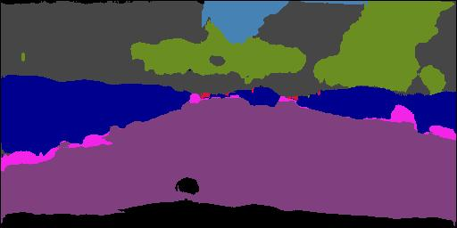
  

  

    
Prediction 4

    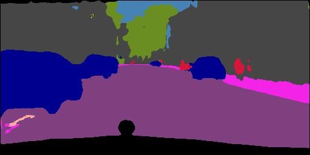
  

  

    
Prediction 5

    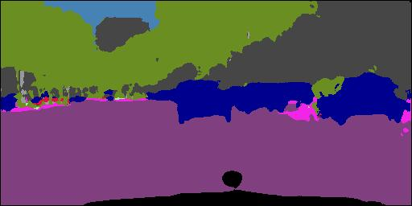
  

  

    
Prediction 6

    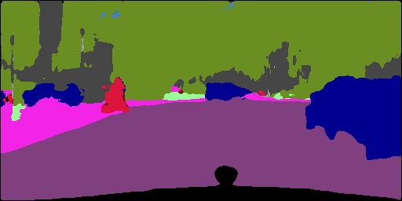
  

Where one can visually see improvements as the model train in the first half, but slows down as the training progresses

---

## Inference
- To test out the model: 
  - First, gather testing images into the `InferenceOutput/TestImages` folder
  - Then, run `inference.py` where it will resize the images (if needed) then pass the images to the model to predict the segmentation mask
  - Results would be stored in `InferenceOutput/TestPredictions` folder

---

## Results

### Test Images
- Here is two images along with their corresponding predictions using the trained model

  

    
Test 1

    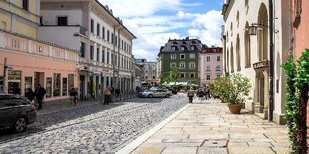
  

  

    
Test 2

    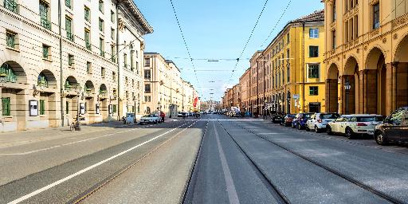
  

  

    
Pred 1

    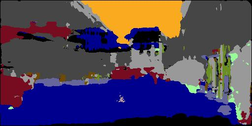
  

  

    
Pred 2

    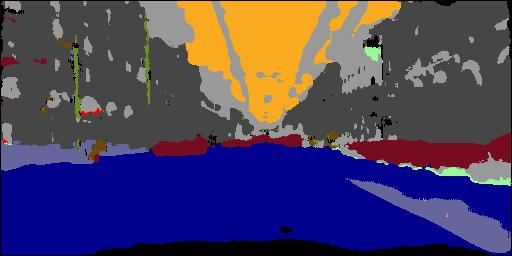
  

So a few things to note here: 
1. The predicted mask for Test 1 isn't good, actually, it's pretty bad. This likely due to, 
   - The Cityscapes dataset that was used consists of images taken around various cities in Germany and other countries, therefore using random images of 'cityscape' found on the net wouldn't quite suffice, as there are some fairly large deviation from the dataset the model was trained on
   - In particular, notice how the predicted masks during training (Pred 1-6) all had a black-area at the bottom, that's because in the provided masks, that area is the vehicle where the camera was mounted. Each time the camera took an image, a bit of the front bumper was in the lower area and was labeled as a black-pixel, thus, even when the random test images doesn't have a car's front bumper at the lower portion of the image, the model would still label it 'black', due to overfitting. 
2. The second image's mask is better, since it's a closer representation of the dataset, but still isn't very good. Again, it still have black pixel labels at the bottom due to overfitting.
3. Again, random images from the web wouldn't be a very accurate representation of what the model was been trained on, so expect some not-very-good masks produced. However it is sufficient to see what the model has learned.

### Training Evaluation
- The model was trained for approximately 10 epochs, and although losses are decreasing marginally in the last epoch or two, it is still decreasing none-the-less
- Near the end of training, the training loss and validation loss reached around 1.12 and 1.21 respectively (rough average)
- Mean IoU was around 0.61, where 1 indicates perfect overlap, 0 is no overlap. This is a bit low, additional details will be mentioned in the **Notes** section below
- The final model took around 4.5 hours to train on a single NVDA RTX4090 GPU for approximately 10 epochs

---

## How to Use

Highly doubt anyone would even reach here lol, but I'll include this section in the faintest chance anyone is interested in trying this out :p
I'll be providing general steps, but nothing too specific

1. Clone this repository
2. Populate the `Dataset` folder, detailed instructions can be found within the `Dataset/readme.md` file
3. Once the dataset is added, just run `training.py` and the training should begin
4. When the model is finished training, there should be a `unet_model.pth` file, which contains the state_dict of the unet model
5. Run `inference.py` for inferencing

---

## Challenges and Future Improvements
Looking back to when I was working on this project, I would say there were two major challenges:
1. Dataset sourcing. Finding a good dataset can be pretty hard, especially for a personal project like this. Not to say that there isn't any good datasets, but just that there a quite a large number of datasets that are 
   - Too large (in terms of # of images and/or number of classes), such as COCO or Open Images
   - Too small (again, in terms of images/classes)
   - And incomplete datasets, which was surprisingly common
2. Training Progress. In particular, how the model learns. I tried to optimize the overall training process, such as adding in gradient accumulation, loss combination, gradient clipping, adding norm/dropout layers, etc., but the resulting model is still far from ideal. Wouldn't really even be considered 'good'. Although I can continue to optimize and train the model through various testing to try and improve the model, I feel like I shouldn't go too far into that rabbit hole. The primary purpose of this project is to learn new materials (e.g. U-Net architecture, what is/how does semantic segmentation work, etc.), not to create a very good model.

Overall, it's an enjoyable project that I had fun researching/implementing. 
As for future improvements, I might come back and work on it again, but that would be later on if it happens.

---

## Notes
Finally, there are a few points that I would like to address: 

1. I will again reiterate that this is just a project that explores how semantic segmentation works and understand how underlying arch (U-Net) rather focusing on how well it performs
2. For Cityscapes dataset, there is 30 classes, but I've filtered 6 that is underrepresented (Occurs once every so often) for better training
3. The calculation of IoU metric is a bit skewed, as all classes are weighted equally in the mean_iou calculation. However since some of the classes are disproportionally represented. Some only have a handful of pixels per image compared to other classes which can take up over a quarter of it. The current model would focus much more on the larger contributor of the loss, thus mean_iou would be lowered by the rare pixels even though they don't occur very often.

---

## Acknowledgments
@misc{ronneberger2015unetconvolutionalnetworksbiomedical,
      title={U-Net: Convolutional Networks for Biomedical Image Segmentation}, 
      author={Olaf Ronneberger and Philipp Fischer and Thomas Brox},
      year={2015},
      eprint={1505.04597},
      archivePrefix={arXiv},
      primaryClass={cs.CV},
      url={https://arxiv.org/abs/1505.04597}, 
}

---

## References

### Citation for `Cityscapes` Dataset
M. Cordts, M. Omran, S. Ramos, T. Rehfeld, M. Enzweiler, R. Benenson, U. Franke, S. Roth, and B. Schiele, “The Cityscapes Dataset for Semantic Urban Scene Understanding,” in Proc. of the IEEE Conference on Computer Vision and Pattern Recognition (CVPR), 2016. [Bibtex]

